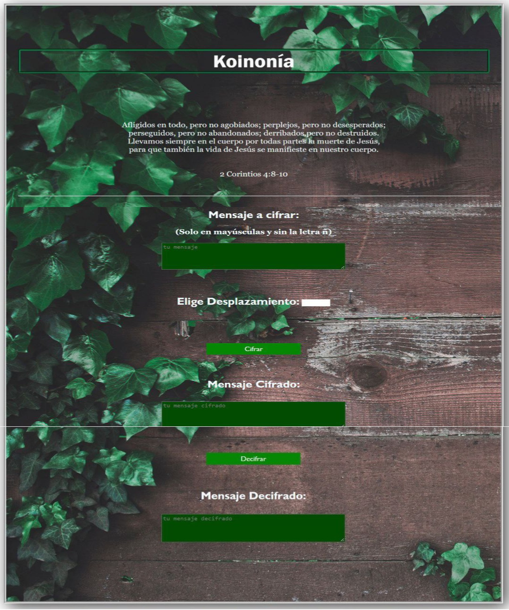

### Koinonía

La koinonía es un concepto teológico que significa comunión. Como tal, se refiere a la comunión eclesial y a los vínculos que esta genera entre los miembros de las iglesias cristianas y Dios. La palabra proviene del griego κοινωνία (koinonía), que traduce comunión o participación en lo común.

Nuestra aplicacion web quiere lograr una comunión y una comunicación a traves del cifrado Cesár que sirva para resguardar vidas, mantenerse informados y lograr una comuniación efectiva sin ser descubiertos, todo eso por medio del anonimato.

- ¿Quiénes son los principales usuarios de este producto?

Los principales usuarios para este producto son personas misioneras hispano parlantes que esten en el Medio Oriente, en zona de conclicto y persecusión religiosa, los cuales necesitan comunicarse entre si, para coordinar reuniones, tiempo de comunión y culto.

- ¿Cómo crees que el producto que estás creando está resolviendo sus problemas?

Nuestra apliación web logra el objetivo de que nuestros usuarios puedan con libertad comunicarse entre si de una manera rapida, personal y segura.

## Prototipo Baja Fidelidad

Este es el prototipo creado en el primer sprint del proyecto 

  

## Prototipo Versión Final  

<strong> Modo de uso:</strong>   
En la primera sección de la página encontramos un mensaje reflexivo y de aliento para nuestros usuarios.  
En la segunda sección encontramos los input de texto para ingresar un mensaje el cual posteriormente será cifrado y decifrado, en este primer input se coloca el mensaje que se desea cifrar, luego el usuario debe ingresar el valor (0 - 26) de desplazamiento que desea ultilizar para cifrar dicho mensaje. 
Este mensaje debe ser en mayúsculas y sin la ultilización de la letra (ñ) 

Para Ejecutar el ingreso del mensaje, el desplazamiento y poder ver el resultado se debe dar click en el boton "Cifrar" el cual arrojará un resultado en el siguiente input de texto llamado "Mensaje Cifrado"   

Para poder ver el mensaje decifrado se debe dar click en el boton decifrar y el resultado se vera reflejado en el ultimo input de texto llamado "Mensaje Cifrado"  

### Página del Proyecto Cipher

https://danielaramirezcanquiz.github.io/SCL021-cipher/
